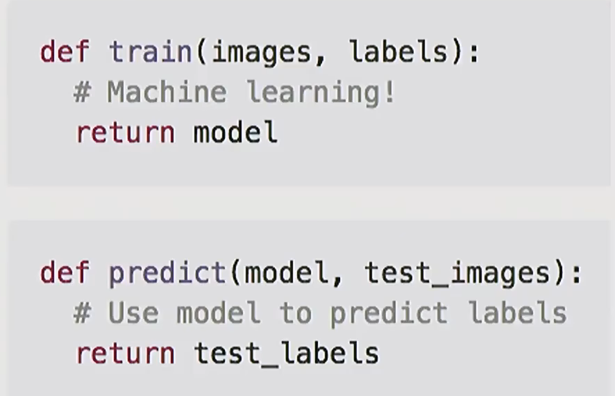
### 关于分类器
1. 比较原始的方法，nearest neighbor
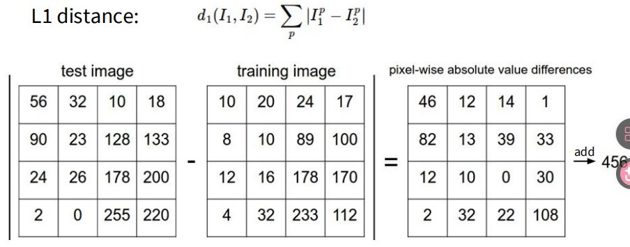
L2则是计算平方和
K值指的是选择K个与待分类对象最近的图片，然后根据这k个图片的种类，看哪个种类最多就分给哪一类
2. 线性分类器
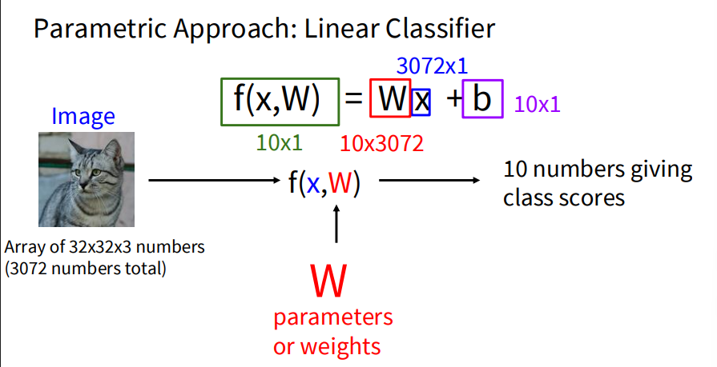
可以看下面的图简单理解，相当于把每个种类摊开，和摊开后的待分类图做点乘，然后加上一个偏置，得到该种类最终的分数

线性分类器可以理解为模版匹配，另外我们总是写成Wx+b不太方便，可以直接写成Wx,具体见下图
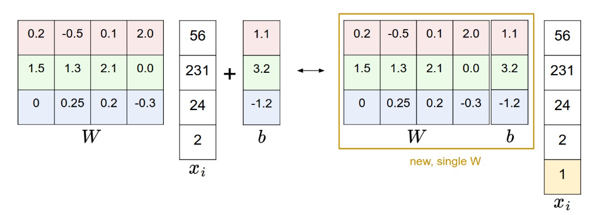
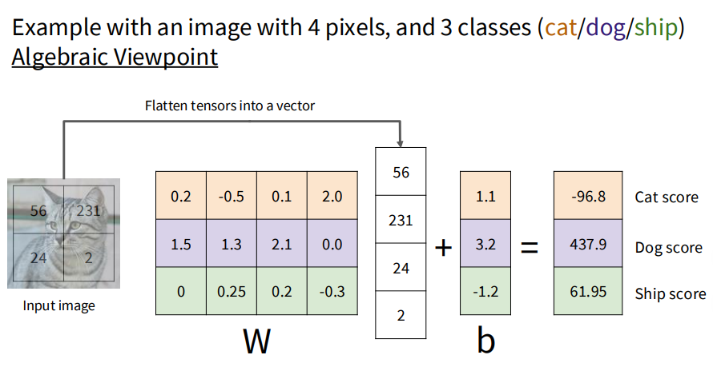
而关于为什么需要一个b,可以理解为$W$ 决定了超平面的法向量方向（即它在空间中如何倾斜），而 $b$ 决定了超平面的位置偏移（即它距离原点有多远）。
**关于为什么需要有b，我们还可以从概率论（先验概率，后验概率）的角度来理解这个问题**
由于在图片中，可能本来每一种的分布数量不是均匀的，比如猫占505，狗占10%，那么此时即使给一张看不出什么信息的图片，也会优先猜猫，这就是一种先验分布的修正

同时，b还承担了**补偿特征均值偏移**的任务，比如如果“猫”的平均像素亮度是 100，而“狗”是 50。即使两类数量一样多，为了让决策边界处于 75 这个位置，你也需要一个 $b$ 来把原本经过原点的直线平移过去。

#### 具体的证明步骤：
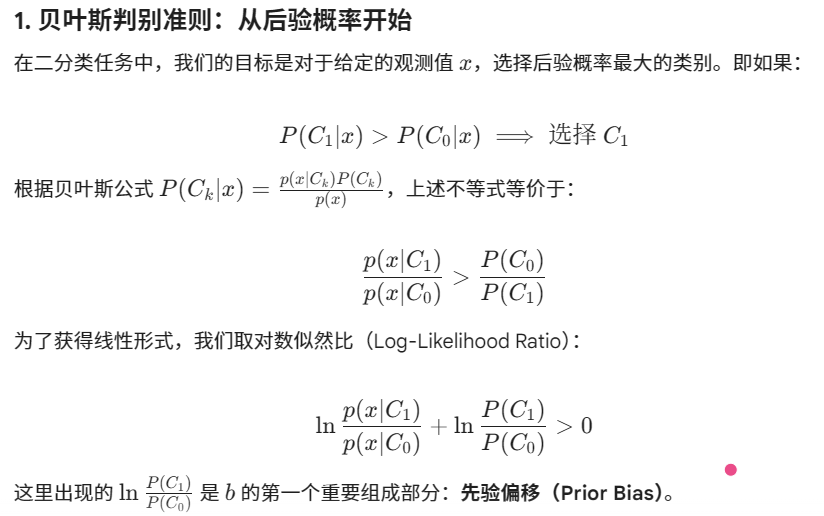
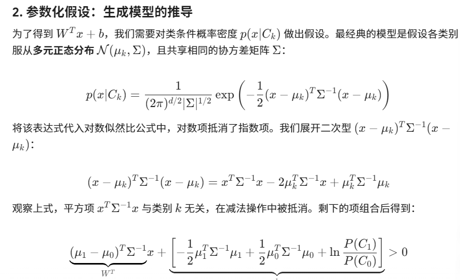
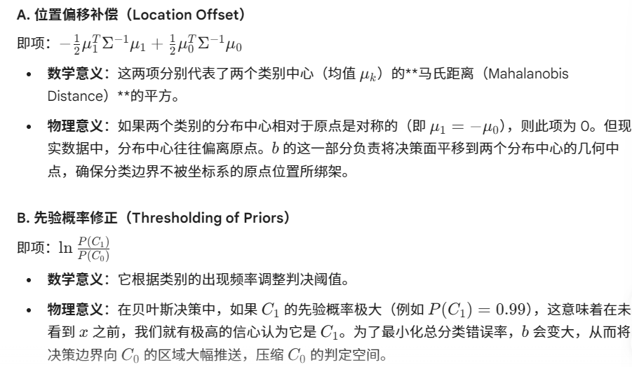
由上面的要求我们就能看出b被拆分成位置偏移补偿和先验概率修正

### 关于loss的计算

* SVM
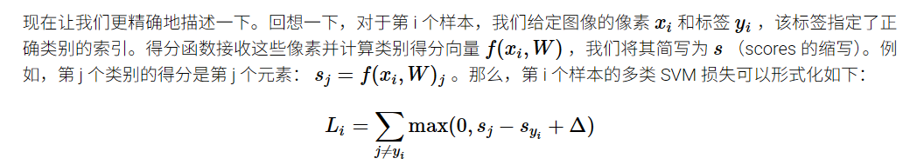
而delta则代表我们认为正确类的得分至少应该比错误类的得分高的程度
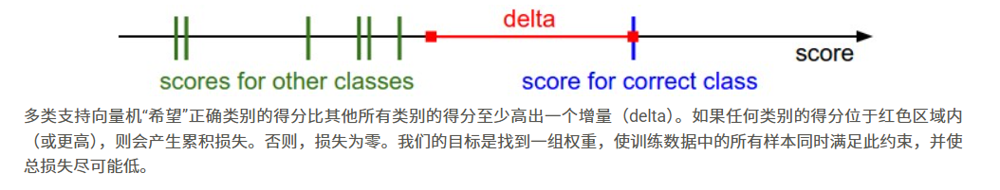
但是如果只采用这种方式会让模型倾向于把w变得越大越好，因为如果w能使得正确类比错误类高出1单位，那么2w就能高出2单位，3w就高出3单位。

  所以我们必须给损失项加一个惩罚项，也就是所谓的正则化（可以防止过拟合）,比如下图的L2正则化
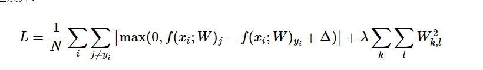
后面那个式子就是把所有参数求平方和，然后乘以一个超参数，就是λ，这个λ。然后注意，我们在实际应用的时候，可以直接把Δ设为1.0，应为真正起作用的是λ和Δ之间的比值，我们直接把Δ固定然后调整λ就可以了

* Softmax

  损失函数的计算与SVM不同。与 SVM 将输出 f(xi,W)
 视为每个类别的分数不同，Softmax 分类器给出了一个更直观的输出（归一化的类别概率），并且还具有概率解释。
  
  loss的计算：
  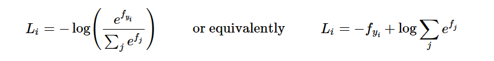
  关于交叉熵
  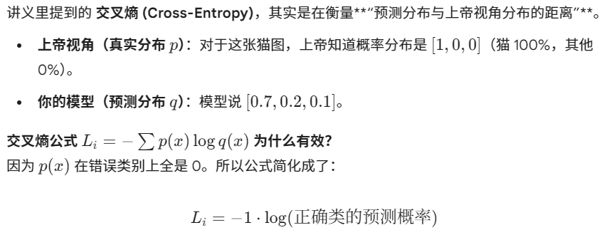
  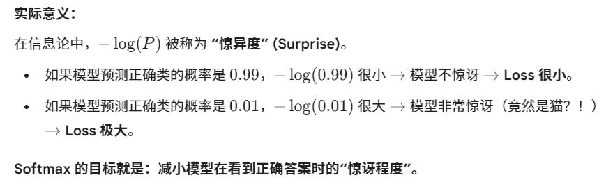
  关于计算时候的处理：
  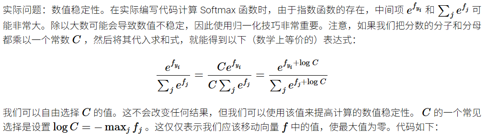

  至于softmax梯度的计算：

  如果j不是正确类别，梯度就是Pj
  如果j是正确类别，梯度就是Pj-1
   
#### 关于两者的比较
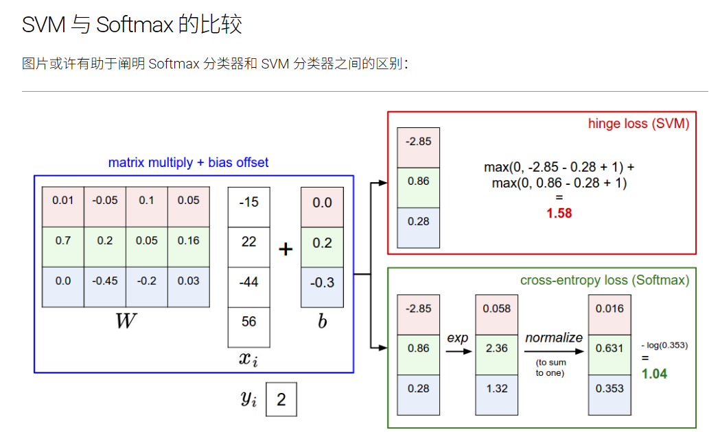

Softmax 分类器永远不会对其生成的分数完全满意：正确的类别概率可以始终更高，错误的类别概率可以始终更低，损失也会始终降低。然而，SVM 在满足边界条件后就感到满意，并且不会在此约束之外对分数进行精细调整。

### Optimization（优化）

目的是找到使得损失函数最小的参数集W

SVM loss函数是凸函数
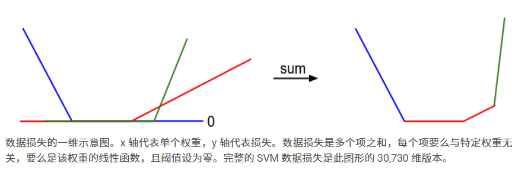

关于找到最优权重的方法

1. 随机搜索：直接指定很多组权重，然后暴力搜索哪一种更好

2. 随机本地搜索：从一个随机W开始，对其产生生成对其的随机扰动 δW，如果扰动后的 W+δW处的损失更低，则进行更新

3.顺着梯度走
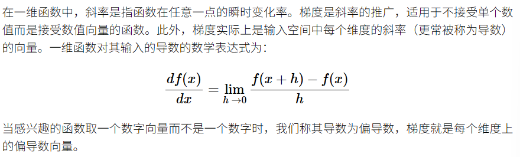

关于梯度的理解：
梯度实际上代表的是一种高维的方向，梯度中每一个元素都代表loss函数对该维度的变量的反应程度，举例来说，x1增加0.1,loss增加3，x2增加0.1，loss增加4，那么梯度方向就是（3,4），后续更新参数的时候，就应该按照（3,4）的反方向走（可以这么理解，3:4应该代表的是每个维度变化的比例，而由于loss是随着x1,x2增加而增加的，我们的目标是使loss变小，肯定要往x1,x2减小的方向，如果Loss随着x的增加而减少，比如x1增加0.1，loss减少3，x2增加0.1，loss增加4，那么我们肯定要往x1增加，x2减少的方向走）

拓展到高维也是同理的

关于计算梯度的方法

1. 数值梯度法
```python
def eval_numerical_gradient(f, x):

  fx = f(x) # evaluate function value at original point
  grad = np.zeros(x.shape)
  h = 0.00001

  # 对每个维度进行迭代
  it = np.nditer(x, flags=['multi_index'], op_flags=['readwrite'])
  while not it.finished:

    ix = it.multi_index
    old_value = x[ix]
    x[ix] = old_value + h # 在该维度上加h
    fxh = f(x) # f(x + h)
    x[ix] = old_value # 记得回复原值

    grad[ix] = (fxh - fx) / h # 记录的是函数在该维度方向上的变化率
    it.iternext() # 继续下一个维度

  return grad

  # to use the generic code above we want a function that takes a single argument
# (the weights in our case) so we close over X_train and Y_train
def CIFAR10_loss_fun(W):
  return L(X_train, Y_train, W)

W = np.random.rand(10, 3073) * 0.001 # 先随机生成参数矩阵
df = eval_numerical_gradient(CIFAR10_loss_fun, W) # 得到梯度

loss_original = CIFAR10_loss_fun(W) # the original loss
print 'original loss: %f' % (loss_original, )

# lets see the effect of multiple step sizes
for step_size_log in [-10, -9, -8, -7, -6, -5,-4,-3,-2,-1]:
  step_size = 10 ** step_size_log
  W_new = W - step_size * df # 向梯度的反方向走，步长不同
  loss_new = CIFAR10_loss_fun(W_new)
  print 'for step size %f new loss: %f' % (step_size, loss_new)
```

2. 用微积分解析地计算梯度

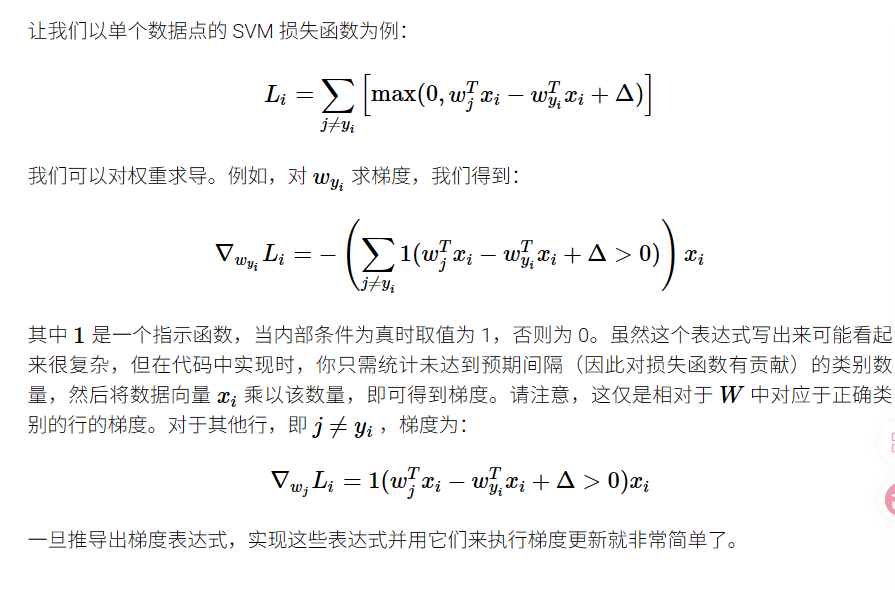

为什么正确类与错误类的更新比例是-n:1,因为从求和式子来看，如果有n个类违反了margin的条件，那么在这n个式子里，
 wyi的导数都是-xi，加起来就是-nxi了，而错误类别如果违反Margin规则，也只会在求和式子里面出现一次，求导就是xi

 **mini batch**
我们定义的目标函数，通常是整个数据集上的平均损失：
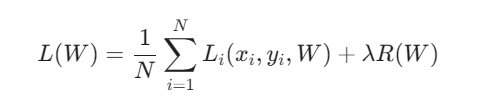
 如果要处理的图片数目很多，计算一次完整的损失函数，我们就要把所有照片的损失求出来然后求均值，最后才能算出梯度，这样就太浪费资源了
 可以随机从照片里面选择一小部分来计算梯度，虽然没有那么精准，但是这是一个平衡精度和速度的办法
 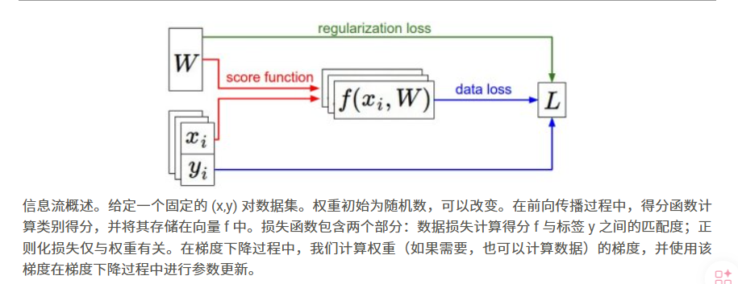

 #### 关于几种优化器
 * SGD
 随机梯度
 * Momentum
 动量法（相当于是这一点采用的梯度不仅仅取决于这一点的趋势，还会被之前点的趋势影响）
 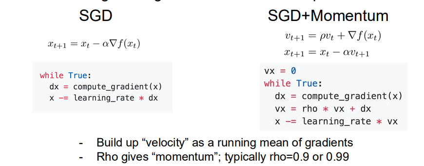
 * PMSProp
 


