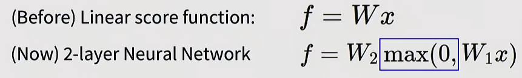
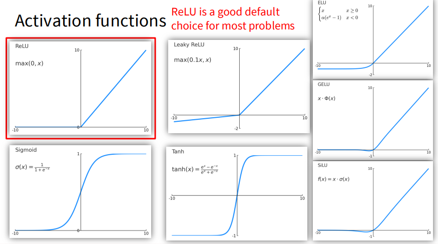
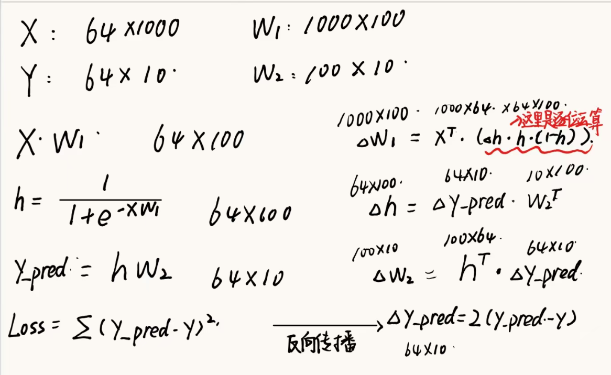
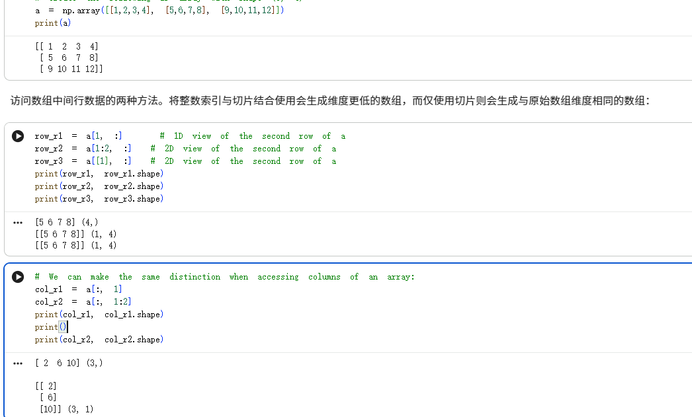
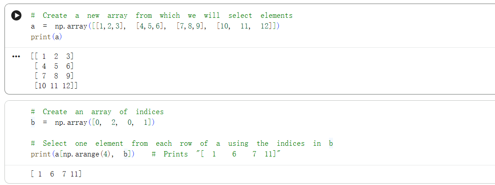
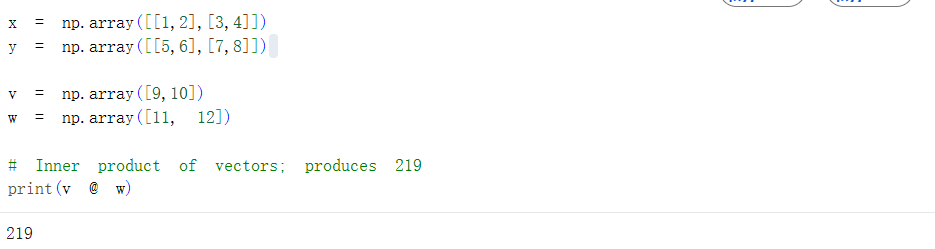
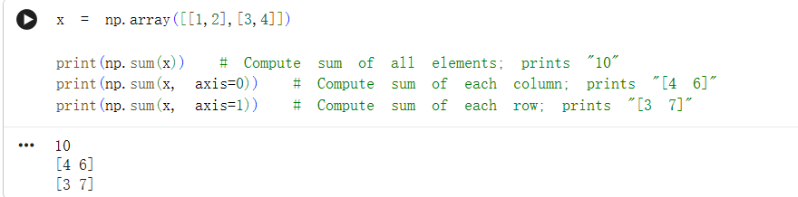
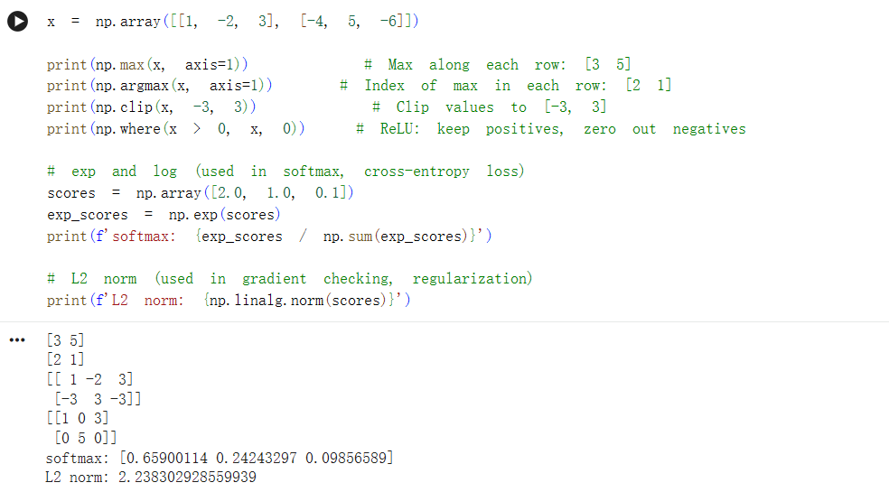
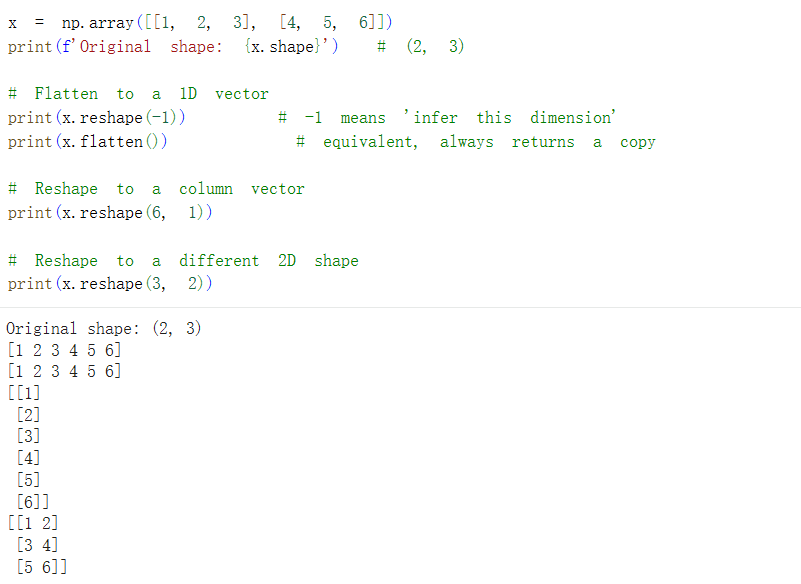
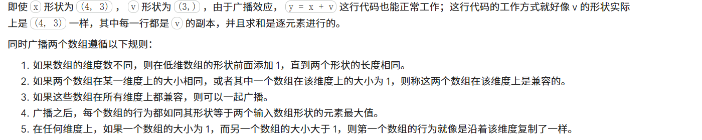

### 神经网络

ReLu在这里作为激活函数，起到了打破线性组合的作用（相当于加入了逻辑判断）


一个实现的例子
```python
import numpy as np
from numpy.random import randn

# N: Batch Size，有多少张图片
# D_in: 输入维度 1000 (比如 1000 个像素点)
# H: 隐藏层维度 100 (中间有 100 个神经元在提取特征)
# D_out: 输出维度 10 (比如识别 10 个数字)
N, D_in, H, D_out = 64, 1000, 100, 10

# 随机生成输入数据
x, y = randn(N, D_in), randn(N, D_out)

# 随机生成权重矩阵
# w1: (1000, 100) - 把 1000 个像素映射成 100 个特征
# w2: (100, 10)   - 把 100 个特征映射成 10 个类别的得分
w1, w2 = randn(D_in, H), randn(H, D_out)

for t in range(2000):
    
    # 算隐藏层。x(64,1000) .dot w1(1000,100)=(64,100)
    # 然后套一个 Sigmoid 激活函数
    h = 1 / (1 + np.exp(-x.dot(w1)))
    
    # 算预测值。h(64,100) .dot w2(100,10) = (64,10)
    y_pred = h.dot(w2)
    
    # 算 Loss。预测值和真实值差的平方和
    loss = np.square(y_pred - y).sum()
    print(t, loss)

    # 反向传播
    # Loss = (y_pred - y)^2 -> 导数就是 2 * (y_pred - y)
    # grad_y_pred 形状: (64, 10)
    grad_y_pred = 2.0 * (y_pred - y)
    
    # 2. 计算 w2 的梯度。
    # 规则：求 w2 的导，就把左边的 h 转置一下点积右边的报错信息
    grad_w2 = h.T.dot(grad_y_pred)
    
    grad_h = grad_y_pred.dot(w2.T)
    
    # 其中 h*(1-h) 是 Sigmoid 函数的局部导数
    grad_w1 = x.T.dot(grad_h * h * (1 - h))

    # 按学习率(1e-4)反方向更新权重
    w1 -= 1e-4 * grad_w1
    w2 -= 1e-4 * grad_w2
```
上面那个代码的推导，主要还是要看维度


numpy语法


@可以用来做矩阵相乘





broadcast（让两个尺寸不同的数组可以相加减），这一思想将在项目中大量运用

反正就是在涉及矩阵运算的时候，尽量不要用for循环
在计算机视觉中，图像本质上就是 NumPy 数组。一张彩色图像是一个形状为 (H, W, 3) 的三维数组（高度、宽度、RGB 通道数），而一批图像则是一个形状为 (N, H, W, 3) 的四维数组。理解形状和坐标轴对于完成作业至关重要