几种模型的区别
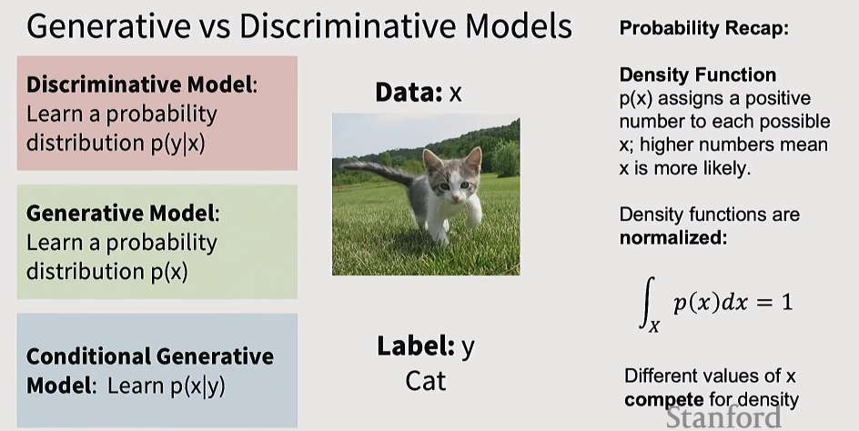
辨别式模型就是在给定一个输入的情况下，判别他属于某个标签的概率。输出的是一个条件分布。

生成式模型则是给每一种可能的像素分布以一定的概率，目标是让更有可能出现在世界上的图片的概率增加，而减少不合理的图片的概率
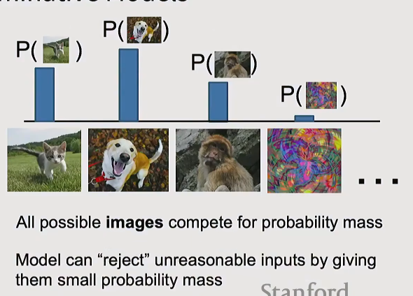

条件生成式模型则是给定一定条件（比如给定一定的语言提示）的条件下，图片的概率分布

而由上面的式子，我们联想到贝叶斯公式：
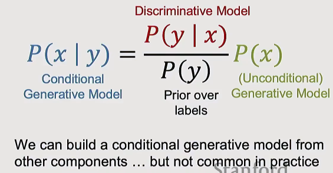

关于生成式模型的几种类别：
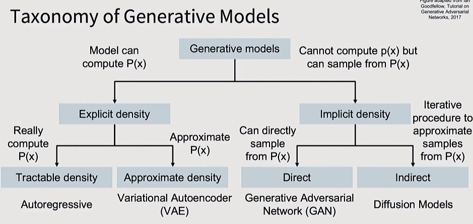
显式密度（Explicit Density）
必须把概率公式 $p(x)$ 明明白白地写出来、算清楚。
* 自回归模型（Autoregressive）： 极其严谨，像素挨着像素、单词挨着单词地精确计算。在图像领域因为太慢被冷落，但目前统治了文本领域（ChatGPT 的底层逻辑就是文本的自回归）。
* 变分自编码器（VAE）： 既然精确公式解不开，就用数学技巧找个“替身”来估算。训练稳定，但因为是估算，生成的图像往往比较模糊。

隐式密度（Implicit Density）
 彻底放弃了复杂的数学概率计算。不管公式是什么，目标是“画”出符合现实规律的图。
* 生成对抗网络（GAN）： 直接出图（Direct）。让“造假网络”和“警察网络”互相博弈互卷，一秒钟直接甩出高清大图。图像清晰，但由于缺乏数学公式兜底，模型极易崩溃，极难调参。
* 扩散模型（Diffusion Models）： 间接出图（Indirect）。从一堆纯噪点开始，经过几十步的耐心雕刻，一点点把噪点擦除，还原出精确的图像。是当前 AI 图像/视频领域的绝对霸主（Sora、Midjourney、Stable Diffusion 都在此列）。代价是生成过程相对较慢。

MLE
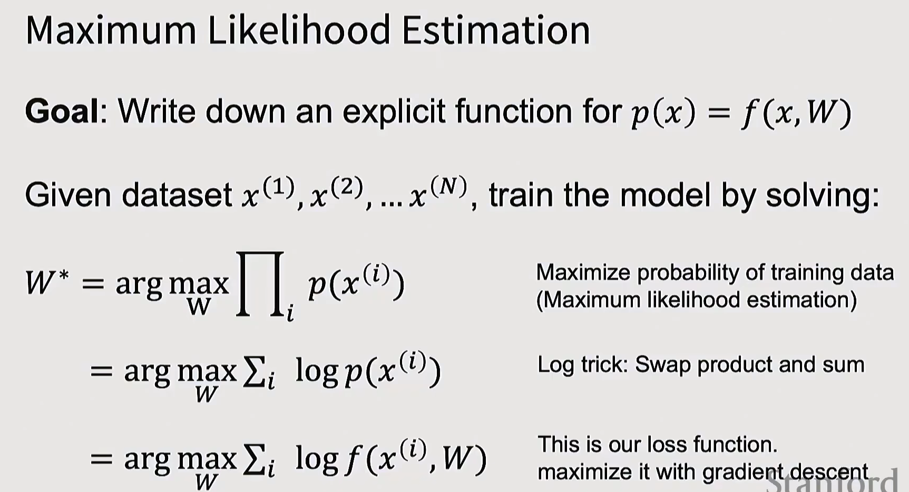
简单来说，就是一组数据集既然被我们观测到了，我们的目标便是找一组参数，能够最大化这组数据集出现的概率，在这里我们假设数据集是独立同分布的  

自回归模型
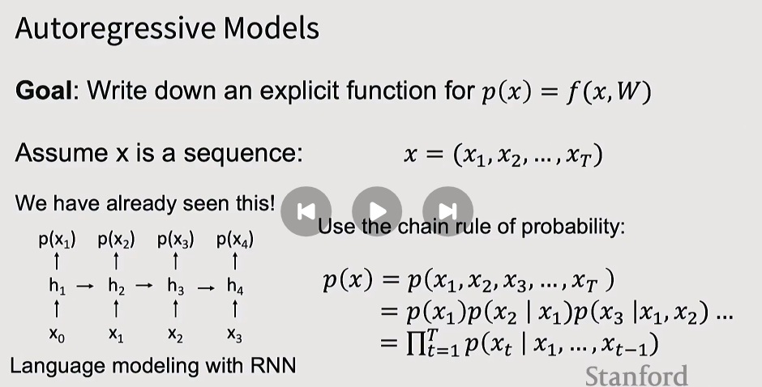
上图主要说的就是，我们的目标是要求极其复杂的联合概率 $p(x)$。根据数学理论，可以用链式法则，把它拆解成每一步“看前文、猜后文”的条件概率之积。而从工业上说，我们可以用 RNN（或者现在的 Transformer）这种带有记忆功能的网络结构，完美计算出每一步的条件概率。

VAE
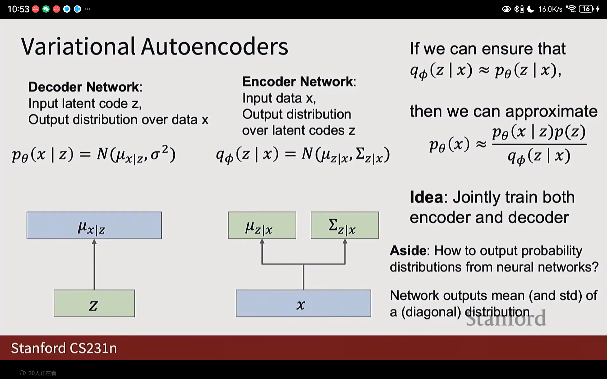
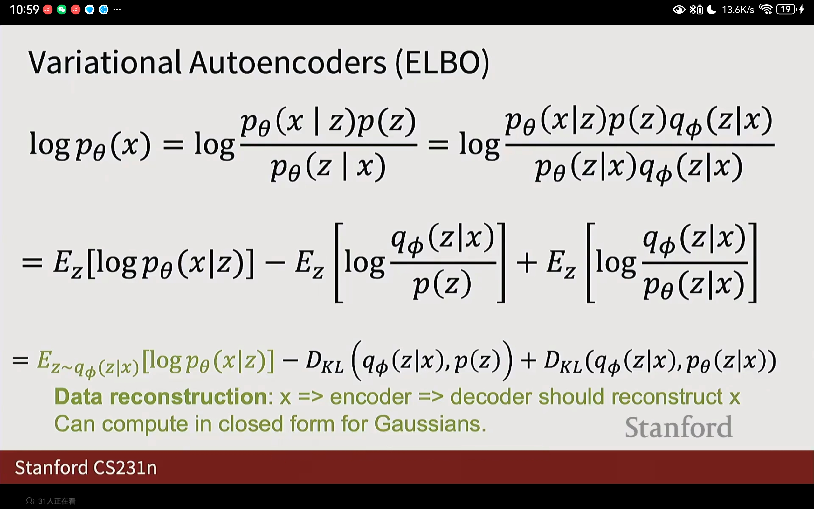
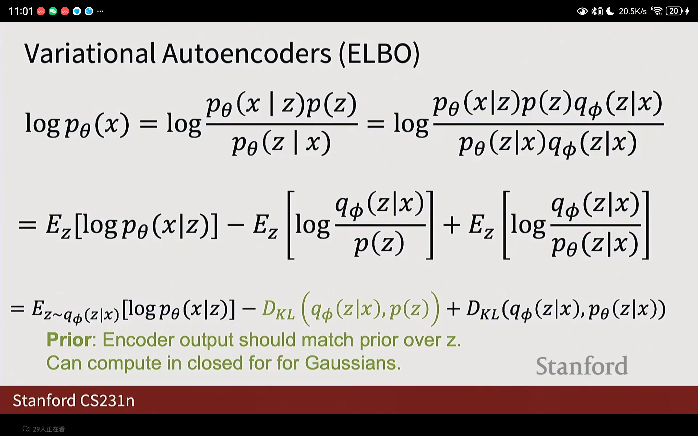
上式的最后一部分是我们无法计算的
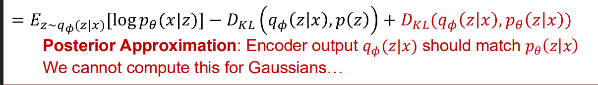
但是我们知道这部分是大于0的
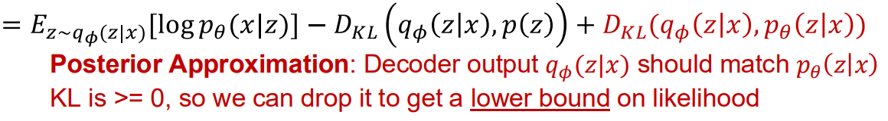
于是我们舍去这一部分，然后VAE的优化目标就变成了优化这个下界
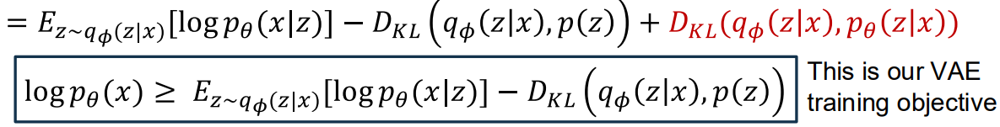

GAN

真实世界的数据符合一个概率分布，叫做p(x),我们有一堆真实照片，目标是让模型画出像真的一样的照片。

我们引入一个隐变量 $z$，它服从一个极简单的先验分布 $p(z)$（比如标准高斯分布/正态分布）。把随机噪音 $z$ 喂给生成器网络 $G$（通常是一堆反卷积层组成的大网络）。$G$ 会把这串无意义的噪音进行疯狂的扭曲、拉伸、计算，最后输出一张有着 RGB 像素的图片 $x$

 生成器 $G$ 批量生产出来的这些假图，也构成了一个属于它自己的分布，叫 $p_G$。我们训练 $G$ 的终极目标，就是让它造出来的假图分布 $p_G$，和真实世界的分布 $p_{data}$ 完全重合 ($p_G = p_{data}$)。

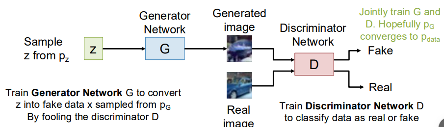

看下面的式子：
Discriminator的目标是尽量最大化真实数据的判别概率（即判别该样本为真的概率）而最小化假数据的判别概率
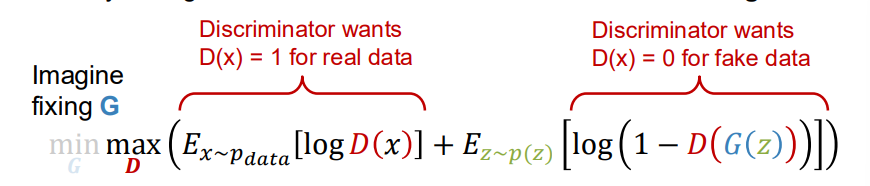

而Generator的目标则是最大化假数据的判别概率
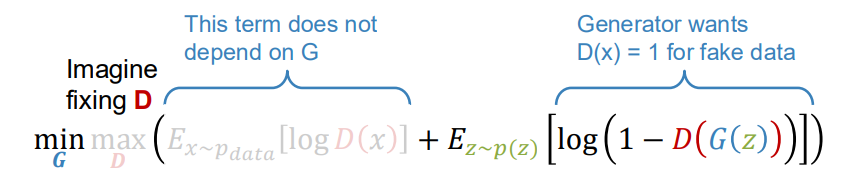

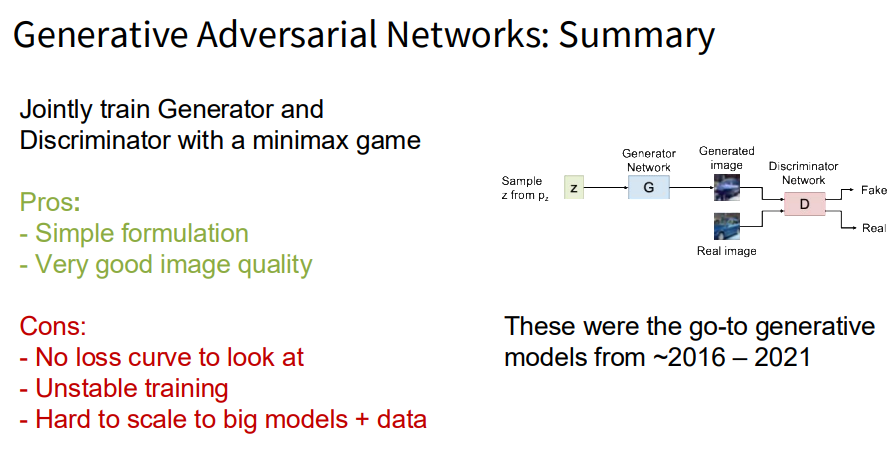

Diffusion Models

首先是给一个真实的图片逐步加噪音，然后训练模型逐步去噪
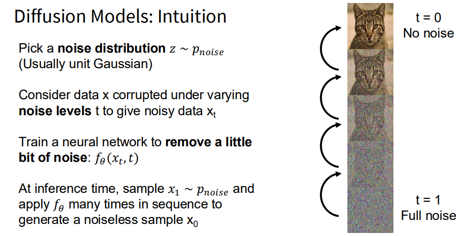

Rectified Flow
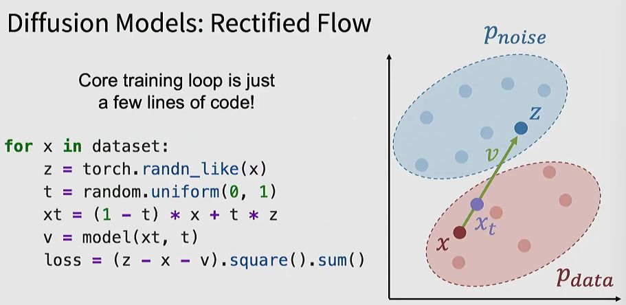
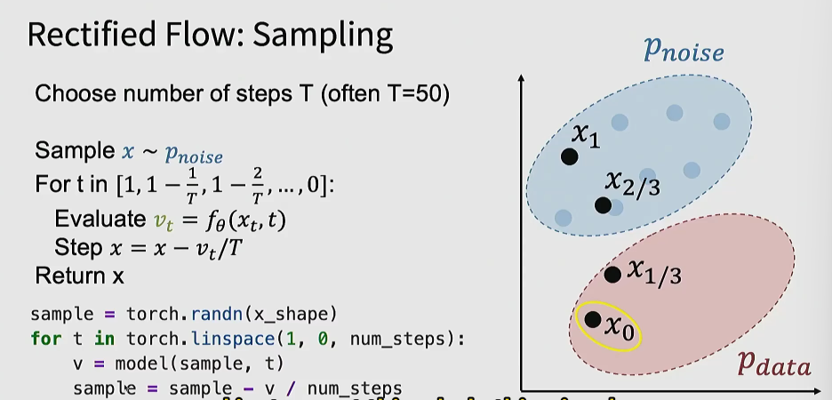

有条件的生成
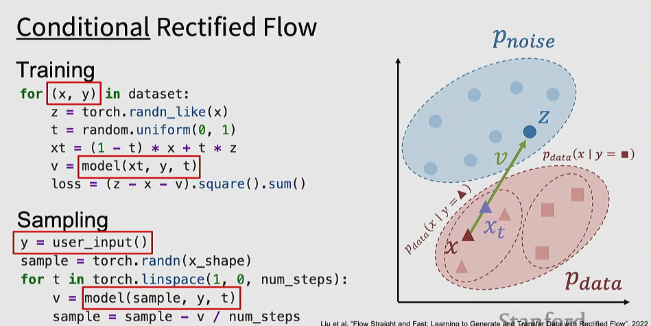
在上图的情况下，真实数据不再只是一个总体的分布，而是区分了不同的类别
for (x, y) in dataset: —— 以前我们只拿图片 $x$ 训练，现在我们把图片 $x$ 和它的文本标签 $y$ 绑定在一起提取出来。

v = model(xt, y, t) 在让神经网络预测方向 $v$ 的时候，我们多塞了一个参数 $y$ 进去。

而在推理阶段，我们同样加入了提示词来指导我们的图片生成

当下常用的模型：
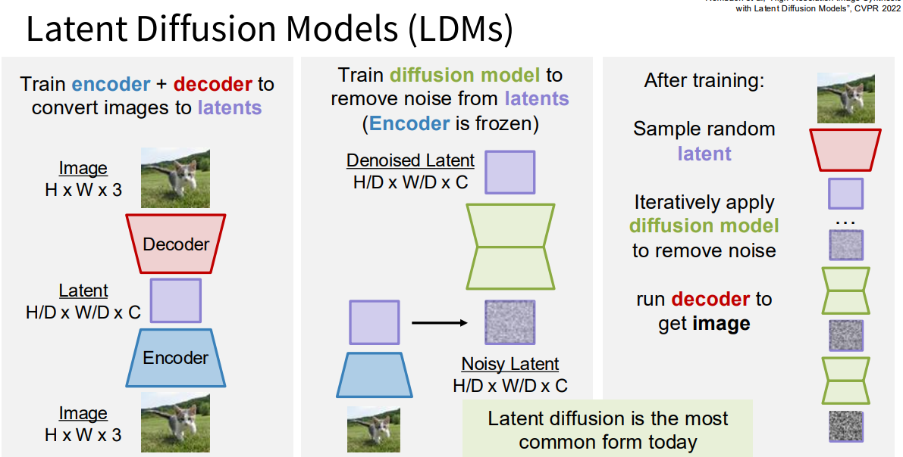

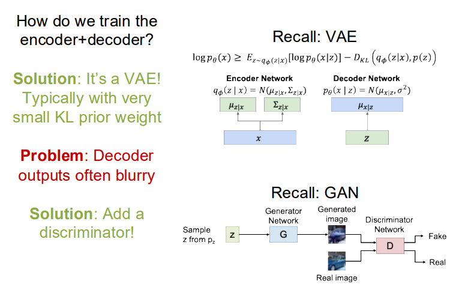