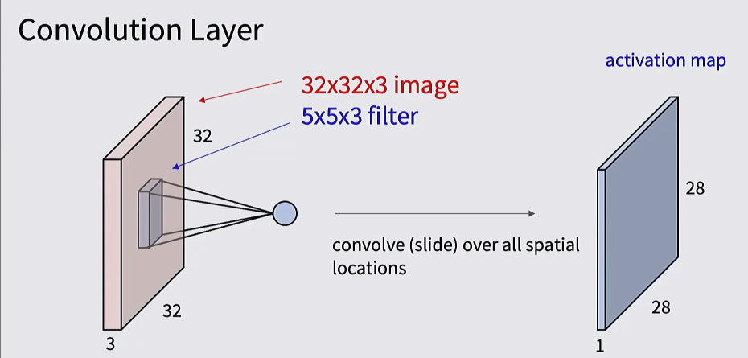
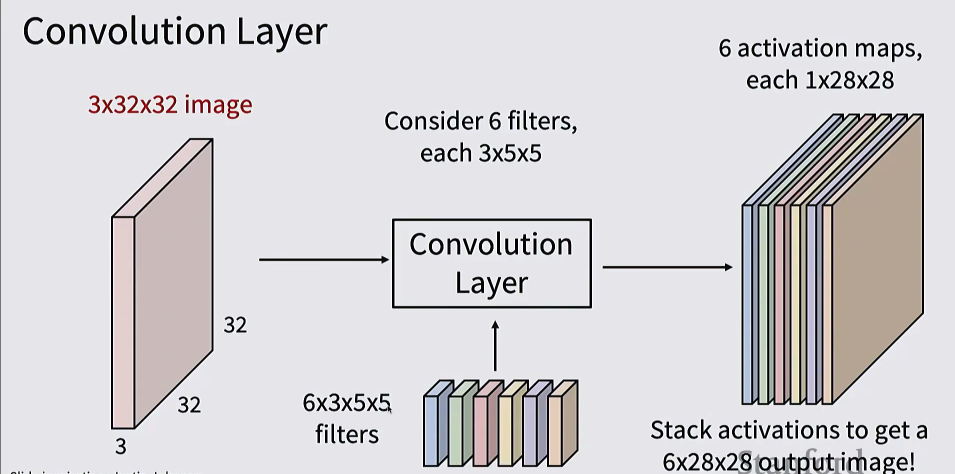
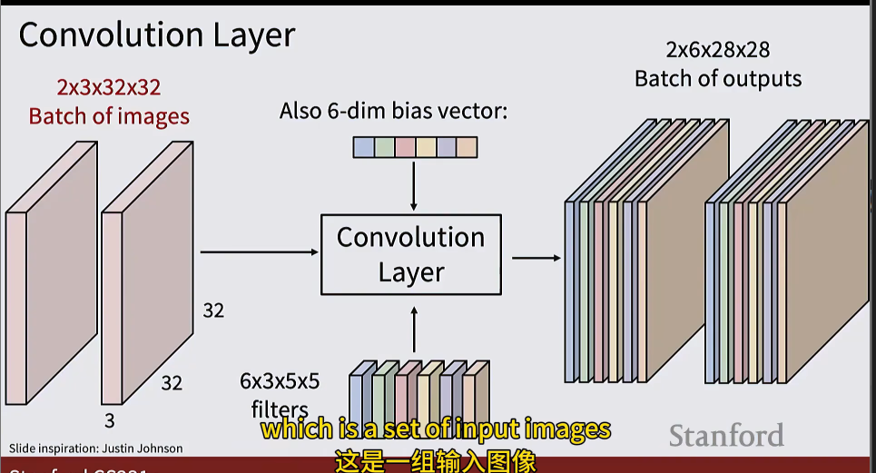
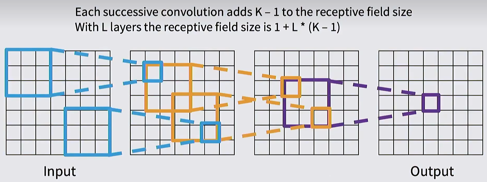
关于参数共享：
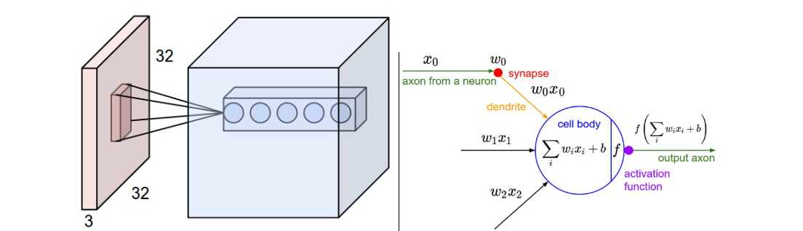
比如上图的例子，我们使用5个滤波器，于是图片在经过第一层卷积计算之后变成了5层，我们算出来的这5层如果还用一个全连接的大矩阵来乘，那么要计算的参数量就太多了。

我们可以这样理解，每一层相仿于是某个特征在图上的探测结果，那么这个特征出现的位置实际上是无所谓的，我们更关注的是他有没有出现，换言之，我们对于同一层可以使用一个参数
但是也要注意，参数共享并不是总是适用的 

#### 归一化
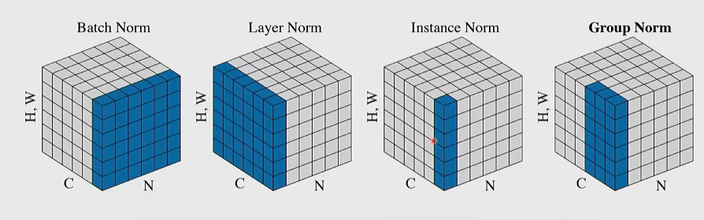
#### dropout
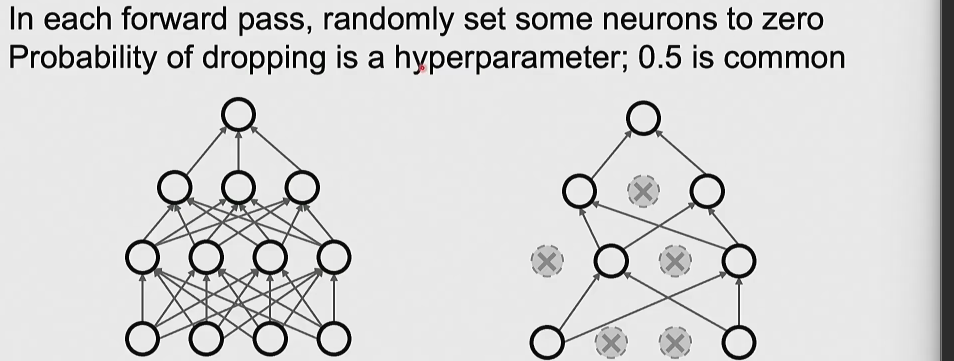
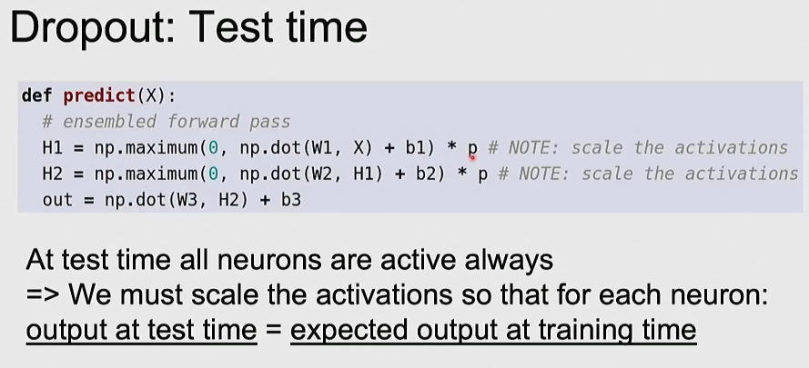

#### ResNet(可以有助于训练更深层次的网络)
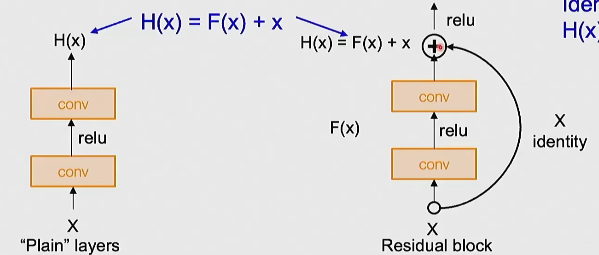
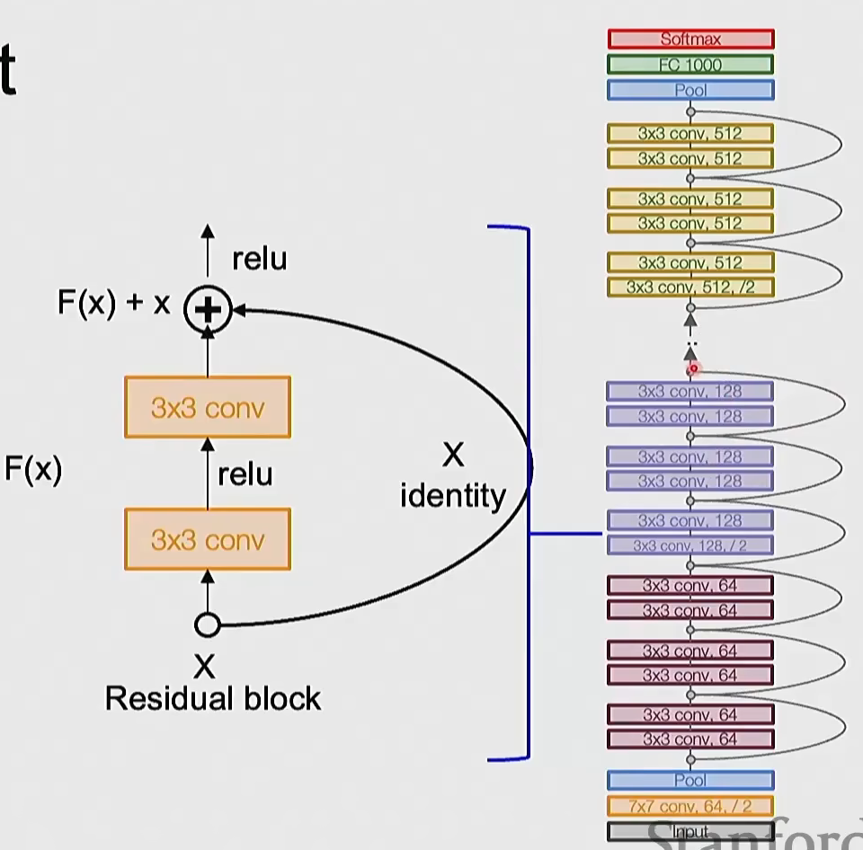

#### 数据增强
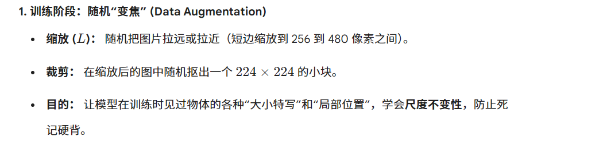
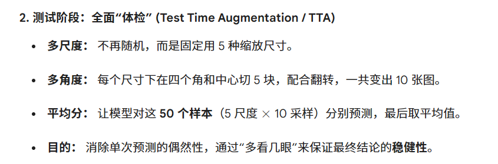