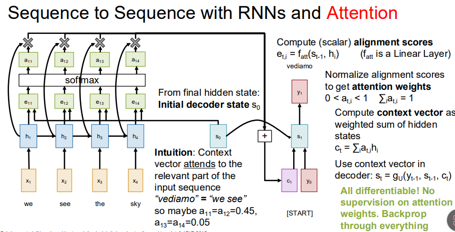
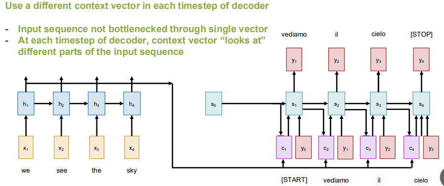
上图是一个注意力机制运用在翻译上面的例子：

这里面实际上融合了RNN的思想，因为这里面也用到了隐藏层。然后主要的不同是加入了一个编码器，一个解码器，然后编码器和解码器分别都有一个隐藏状态，我们是先把所有的原文全部读入进来，生成了一系列的隐藏状态，之后再开始解码，解码的时候先以一个s0作为解码器的初始状态，然后计算这个状态与编码器的每个隐藏状态的相关程度并通过softmax计算出得分，然后让每个编码器的隐藏状态与这个得分相乘并相加，得到一个上下文向量，这个向量与y0一起，计算出解码器的新的隐藏状态s1，根据这个隐藏状态去预测下一个y1,然后再重复该过程（即用新的s1再去生成一个新的c2,再和y1一起去生成y2）

然后这里的s0是编码器读完整个句子之后生成的一个隐藏状态，类似于一个宏观的印象，而y0通常就是一个起始符，代表可以开始翻译

对齐得分矩阵可以帮助直观理解
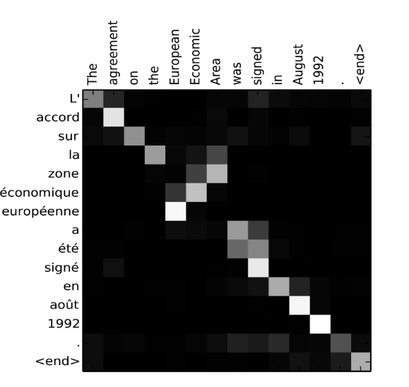

可以发现这个矩阵并非完全是在对角线上的，也就是说模型学到了一些语法知识，然后英语与法语中的词也不是一一对应的

#### 关于query vector,data vector以及output vector
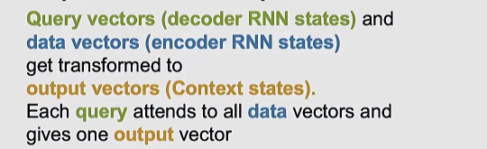

我们可以把注意力机制抽象出来，然后结合矩阵运算，（E和Y都可以通过矩阵相乘计算出来），这里我们计算相似度就可以直接用点积的方式来计算，然后output vector也是一个加群求和，同样可以化为矩阵计算
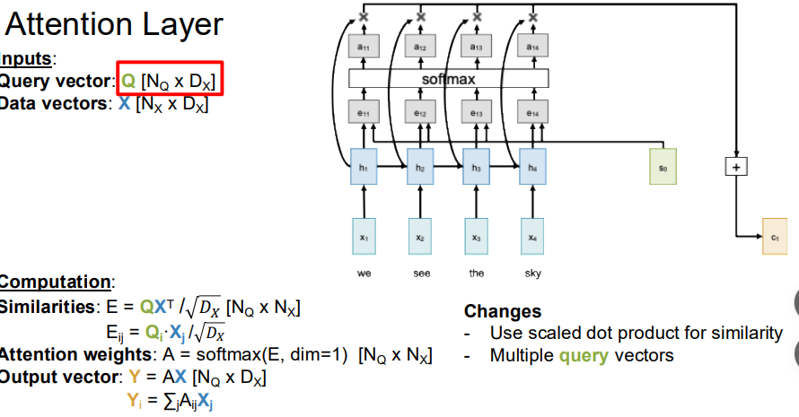
进一步
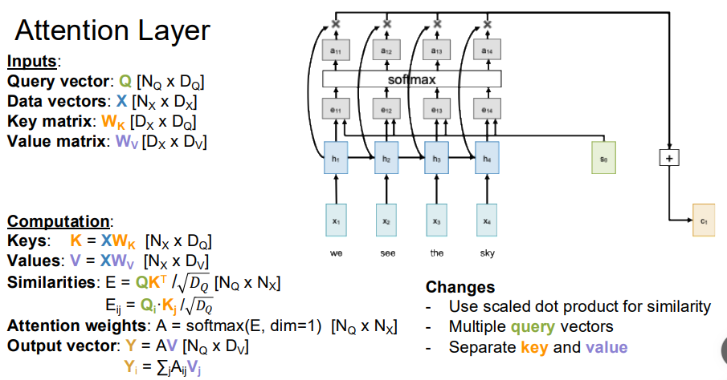
可以看到，这里的一些改进：
* 首先就是在计算相似度的时候，针对维度进行了一个缩放，（比如说在处理分辨率不同的图片的时候，高像素的图片计算点积天然得分就会更高，所以针对维度进行一个缩放可以让训练更加稳定）
* 支持矩阵并行计算，而不用像前面那样等前一个出来才能算后一个
* 把输入向量X划分为key和value,key代表信息在被用来匹配的时候的特征，而value则代表这些信息被提取时的内容特征

#### cross attention layer和self attention layer

cross-attention
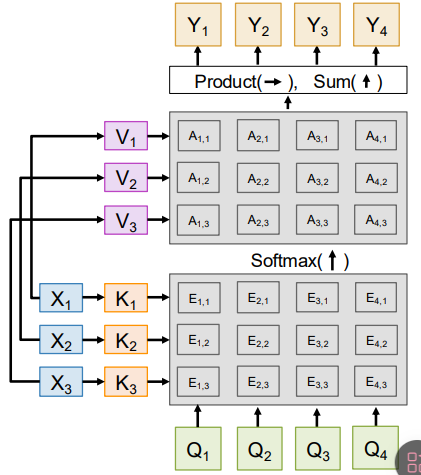
self-attention
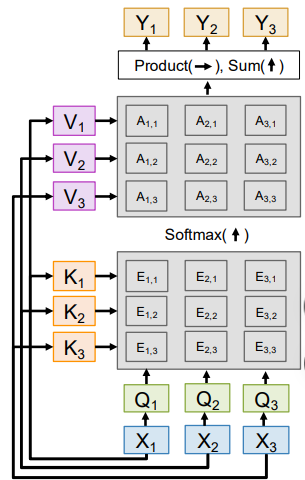
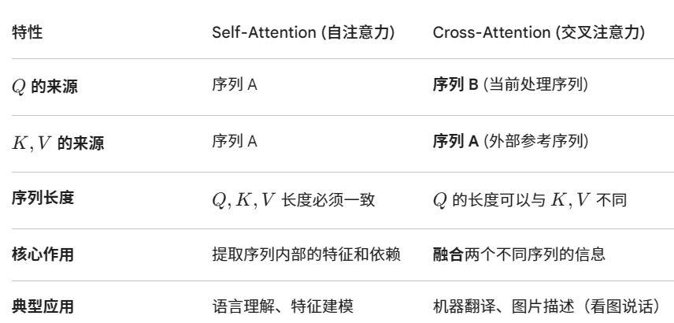
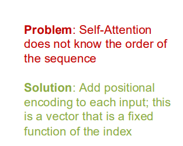

#### transformer架构
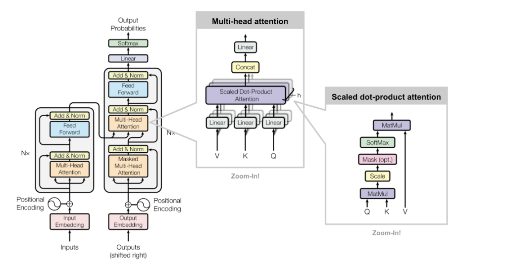
过程简析：

首先读入input,通过embedding变成及其可以理解的向量。通过positional encoding进行编码，记录位置前后顺序。然后通过multi-head attention

（这里的multi-head就能让模型在同一个时间点从多个维度来理解句子，同时有多个K和V，是通过拼接的方式把这些向量组合起来，然后再通过线性变换把这些长向量压缩回原来的维度）

然后经过一个add&norm层（即残差连接和层归一化），再进行前向传播，最后就是得到了一个大的K,V矩阵

然后就到了解码器层面：解码器是根据已经生成的词和K,V矩阵来预测下一个词，并将这个过程循环往复。

**关于masked multi-head attention层，为什么要有mask呢，这里我们可以分为训练阶段和预测阶段**

**在训练阶段，我们是知道正确答案的，但是我们需要训练模型的预测能力，于是可以选择让模型只读第一个词，只读第二个词，以此类推，来预测后面的词，这个训练过程是并行的**

**而在预测阶段，我们需要和训练方式保持一致。而且为了防止已经算出来的词因为新预测出来的词而改变，我们需要mask**
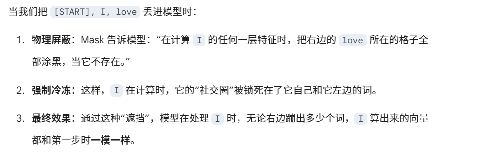

这里可以发现，为什么不直接把已经算出来的词固定住呢，那么这便是KV cache的思想
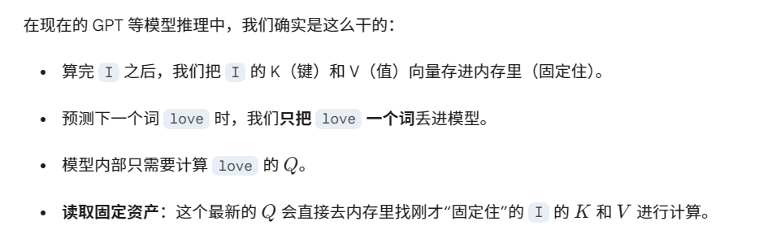

“并行”不是指模型能提前知道未来，而是指我们利用“掩码”技术，把一个长句子的多次预测练习，转化成了可以在 GPU 里同时运行的矩阵运算。