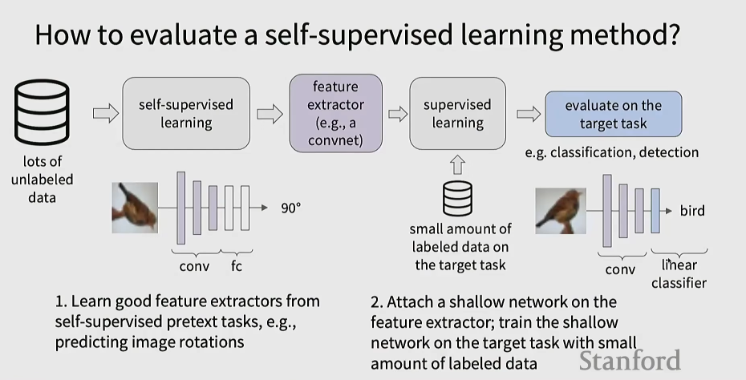
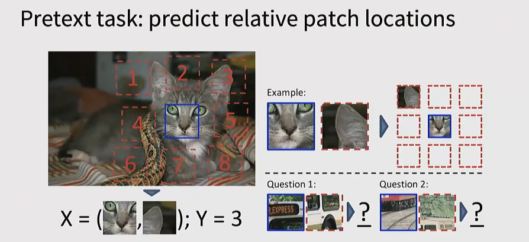
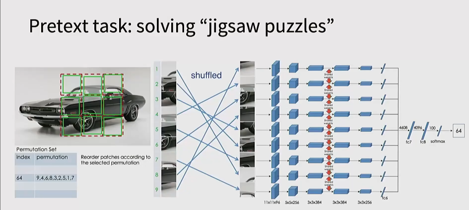
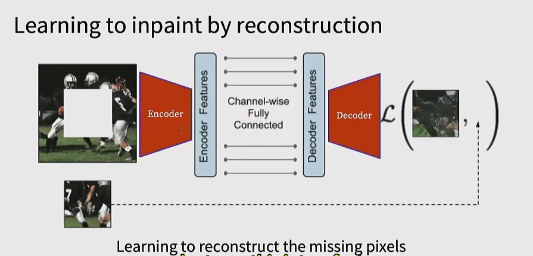
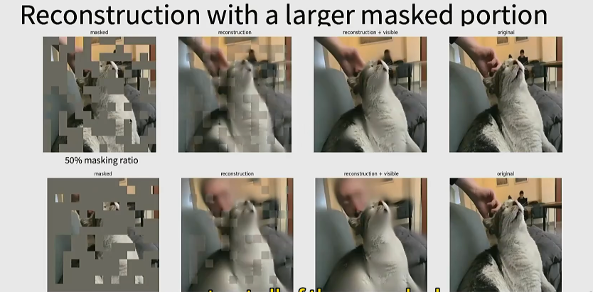
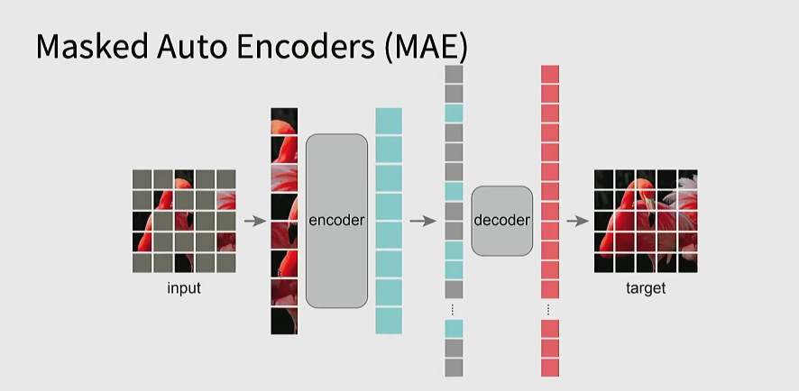
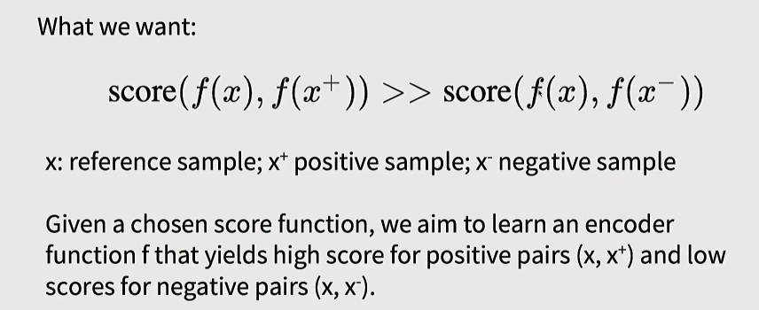
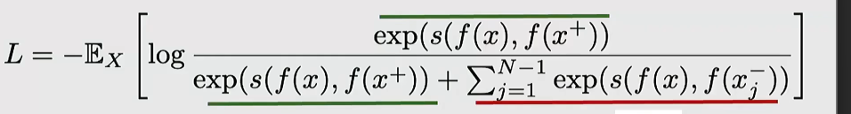

#### pre text task

是一个模型自己给自己出题的“假任务”。

设计它的目的不是为了解决这个任务本身，而是为了逼迫神经网络在解题的过程中，自动学习到数据中隐藏的通用特征和内在规律（Feature Representations）。

在视觉领域常用的一些预训练方法：
* 旋转角度预测（90,180,270,0）

* 
或者直接取一个九宫格，然后让模型进行正确的排序

像下面这个例子，如果算排列的可能的话，一共有9!种，太多了，于是我们人工选择64种可能互相差别比较大的作为标签，这样就是一个64类的分类任务

* 图像挖空

* 图片上色

* MAE

如上图，MAE 拿到一张完好的图片后，会随机将 75% 的区域遮住（Masked），只留下 25% 的可见方块。之所以遮住这么多，是为了迫使模型能真的学到本质。

如上图，我们随机遮住部分图片，把未遮住的喂给encoder,encoder通过学习提取出一些特征向量，然后要注意，这些特征向量和每个小块是一一对应的，并且带有位置编号。

接下来，我们为了能让decoder还原出整张图，我们必须把原来的位置还原。于是，我们把 Encoder 吐出来的向量拿过来，再拿出代表窟窿的Shared Mask Tokens，图中灰色的方块，相当于是按照原位置拼回去，并且要记得给这些方块打上位置编码。

然后decoder就用一些transformer层，来实现对图片的补全，得到完整图片之后再去计算loss。

但整个过程完成之后，实际上我们只需要encoder,这才是我们真正需要的部分。有了这个encoder,我们后续只需要微调就可以去完成一些下游任务。

#### 对比学习

本质就是让相似的靠拢，让疏远的拉开

由上图的计算方式，优化方向便是尽量减少和正样本的距离，增加和负样本的距离
